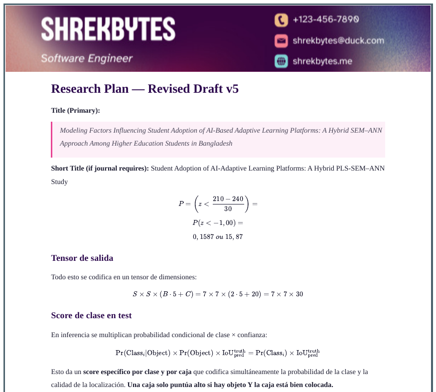
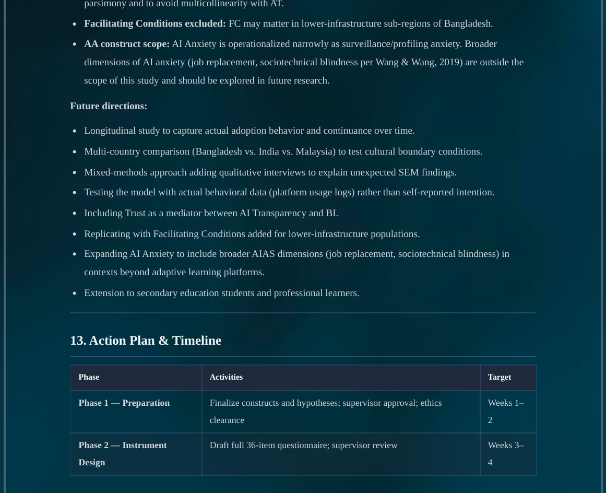

# Advanced PDF Export — Obsidian Plugin

Export Obsidian notes as pixel-perfect PDFs with seven style presets, manual page breaks, full layout control, and a live preview — all from a full-screen modal panel.

> **Desktop only** — requires the Obsidian desktop app (uses Electron's print pipeline).

If this plugin saves you time, consider **[supporting the project](https://shrekbytes.github.io/support/)** ☕

## Table of Contents

- [Features](#features)
- [Screenshots](#screenshots)
- [Installation](#installation)
- [Usage](#usage)
- [Settings Reference](#settings-reference)
- [License](#license)

## Features

- **Live preview** — markdown editor on the left, paginated page preview on the right; render with **⟳ Render PDF** or `Ctrl+Enter`
- **Auto-loads active note** — opening from the right-click menu or command palette pre-fills the editor (edits are local, non-destructive)
- **Seven style presets** — Default, Minimal, Academic, Colorful, Modern, Newspaper, Dark; each fully customisable and resettable
- **Code syntax themes** — 10+ themes (GitHub Light/Dark, Dracula, Tokyo Night, Monokai, Catppuccin, and more) applied independently of your Obsidian theme
- **Mermaid diagrams** — renders flowcharts, sequence diagrams, and all other Mermaid diagram types
- **Page breaks** — `///` on its own line for a manual break; optionally auto-insert before every H1 or H2
- **Page size & orientation** — A4, A3, A5, Letter, Legal, or a fully custom size (mm) × Portrait / Landscape
- **Full layout control** — margins, font family/size/line height, paragraph spacing, heading scale, colors
- **Page frame** — optional border drawn around the outer edge of every page (solid, dashed, dotted, double, groove, or ridge)
- **Background** — solid color or a background image with fit, scope (full page or content area only), and opacity controls
- **Header & footer** — custom text, page numbers (X / Y), alignment, font size/color, optional banner image, and first-page suppression
- **PDF outline (bookmarks)** — heading-based bookmark tree embedded in the exported PDF; most PDF readers display it in a side panel

## Screenshots

### Panel Overview

### Page Breaks

Type `///` on its own line, or click **Insert Page Break** in the toolbar.

### Style Presets

| Academic preset | Style 3 |
|:---:|:---:|
|  |  |

| Style 4 | Style 5 |
|:---:|:---:|
|  |  |

## Installation

### Community Plugins (Recommended)

Search for **Advanced PDF Export** in **Settings → Community Plugins → Browse**, then install and enable it.

### Manual (GitHub Releases)

1. Go to the [Releases](https://github.com/ShrekBytes/advanced-pdf-export/releases) page.
2. Download `main.js`, `manifest.json`, and `styles.css` from the latest release.
3. Place them in your vault at `.obsidian/plugins/advanced-pdf-export/`.
4. Reload Obsidian and enable the plugin under **Settings → Community Plugins**.

## Usage

**Open the panel** — right-click any `.md` file in the file explorer, or use `Ctrl/Cmd+P` → *Advanced PDF Export: Open Panel*. The panel opens as a full-screen modal and auto-loads the target note.

**Edit markdown** — type or paste markdown in the left editor. Changes are not synced back to your vault.

**Insert a page break** — type `///` on its own line, or click **Insert Page Break** in the topbar. Use `---` for a horizontal rule.

**Render the preview** — click **⟳ Render PDF** or press `Ctrl+Enter` / `Cmd+Enter`.

**Change style or page settings** — use the **Style**, **Size**, and **Orient** dropdowns in the topbar. Changes re-render automatically.

**Export** — click **⬇ Export PDF** to open a native save dialog and write the PDF to disk.

**Open settings** — click the ⚙ icon in the topbar, or go to **Settings → Advanced PDF Export**.

## Settings Reference

All settings take effect after closing the settings panel.

### Style Preset

| Setting | Description |
|---|---|
| Preset | Style theme: Default, Minimal, Academic, Colorful, Modern, Newspaper, Dark |
| Reset Preset | Restores all typographic and color values for the current preset to defaults |

### Page

| Setting | Description |
|---|---|
| Page size | A4, A3, A5, Letter, Legal, or Custom |
| Custom page size | Width × Height in mm (visible only when Custom is selected) |
| Orientation | Portrait or Landscape |

### Margin & Frame

| Setting | Description |
|---|---|
| Margins | Top · Bottom · Left · Right in mm |
| Enable frame | Draws a border around the outer edge of every page |
| Frame color | Color of the page frame |
| Frame thickness | Border width in px |
| Frame margin | Gap between the page edge and the frame, equal on all sides (px) |
| Frame style | Solid, Dashed, Dotted, Double, Groove, or Ridge |

### Typography

| Setting | Options |
|---|---|
| Font family | Georgia, Times New Roman, Palatino, Arial, Helvetica, Trebuchet, Courier New, Custom |
| Custom font name | Any CSS font-family value (e.g. `Inter, sans-serif`); font must be installed on your system |
| Font size | 10 – 16 px |
| Code font size | 0.75em – 1.00em |
| Line height | Tight (1.4) → Double (2.0) |
| Paragraph spacing | None → Wide (1em) |
| Heading scale | 0.8× → 1.2× multiplier applied to all heading sizes |

### Background

| Setting | Description |
|---|---|
| Use image background | When on, a background image replaces the solid background color |
| Page background color | Solid fill color behind the page content (shown when image background is off) |
| Background image | Vault-relative path or `https://` URL (shown when image background is on) |
| Fit | How the image fills the page: Cover (fill, crop edges), Contain (fit, show gaps), Fill (stretch), Tile (repeat) |
| Scope | Full page (behind header, content, and footer) or Content area only (text zone only) |
| Opacity | 5% – 100% |

### Colors

| Setting | Description |
|---|---|
| Accent color | Primary accent used for links, borders, and highlights |
| Body text color | Main document text color |
| Heading color | Color applied to all heading levels |
| Blockquote background | Fill color behind blockquote blocks |
| Blockquote border | Left border color on blockquotes |
| Table header background | Background color of table header rows |
| Code background | Background color of inline and fenced code |
| Code syntax theme | Colors fenced code blocks independently of your Obsidian theme. Options: None, GitHub Light, GitHub Dark, Atom One Light, Atom One Dark, Monokai, Dracula, Tokyo Night, Solarized Light, Catppuccin Macchiato, Catppuccin Mocha |

### Header

| Setting | Description |
|---|---|
| Show header | Toggle the header on or off |
| Show on first page | When off, the header is hidden on page 1 (useful for title pages) |
| Header text | Custom text shown on every page |
| Alignment | Left, Center, or Right |
| Font size | Header text size in px |
| Height | Explicit header band height in px (0 = auto-sized from font size) |
| Font color | Header text color |
| Border | Separator line below the header |
| Image | Vault-relative path or `https://` URL — fills the header band as a background banner |
| Image left/right margin | Insets the banner from the left and right page edges (px) |

### Footer

| Setting | Description |
|---|---|
| Show footer | Toggle the footer on or off |
| Show on first page | When off, the footer and page numbers are hidden on page 1; numbering starts from page 2 |
| Footer text | Custom text shown in the footer |
| Alignment | Left, Center, or Right |
| Font size | Footer text size in px |
| Height | Explicit footer band height in px (0 = auto-sized from font size) |
| Font color | Footer text color |
| Border | Separator line above the footer |
| Image | Vault-relative path or `https://` URL — fills the footer band as a background banner |
| Image left/right margin | Insets the banner from the left and right page edges (px) |
| Show page numbers | Toggle *Page X / Y* display |
| Page number position | Left, Center, or Right |
| Page number start | Number assigned to the first visible page number (default 1) |

### Behaviour

| Setting | Description |
|---|---|
| Hide frontmatter | Strip the YAML frontmatter block (`--- … ---`) from preview and PDF |
| Include file name as title | Prepends the note's filename as an H1 at the top of the PDF |
| Underline links | Applies to both internal and external links |
| Auto page break before H1 | Inserts a page break before every `#` heading |
| Auto page break before H2 | Inserts a page break before every `##` heading |
| H1 bottom border | Draws a line under every H1 |
| H2 bottom border | Draws a subtle line under every H2 |
| Center H1 | Centers all H1 headings |
| Striped table rows | Alternating row background on even rows |
| Include PDF outline (bookmarks) | Embeds a bookmark tree built from headings H1–H6 into the exported PDF; most PDF readers display it in a side panel for quick navigation |

## License

Open source under [GPL-3.0 License](LICENSE).

Contributions are welcome — feel free to open issues or pull requests.
