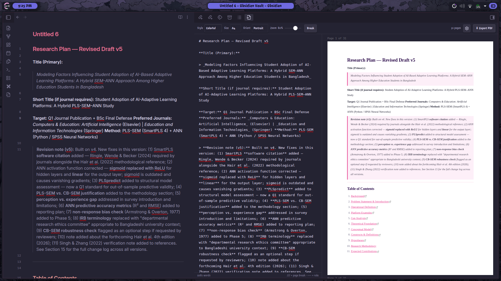
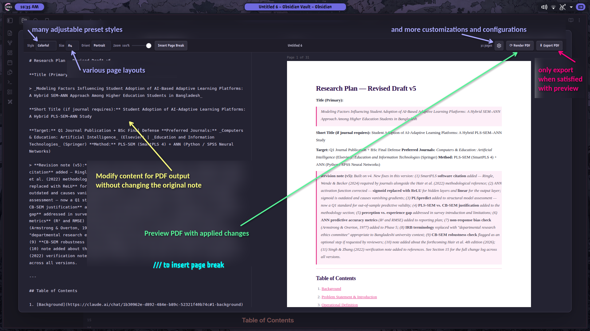
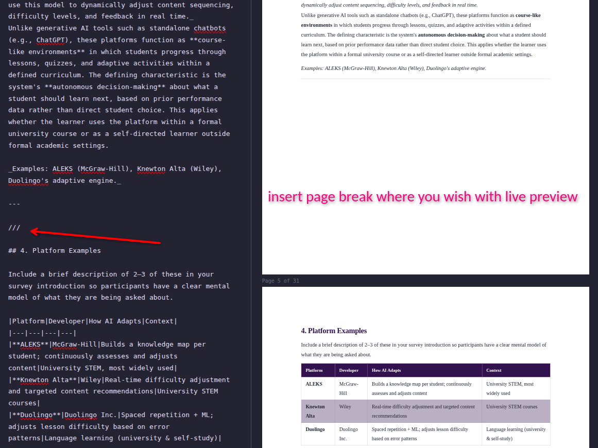
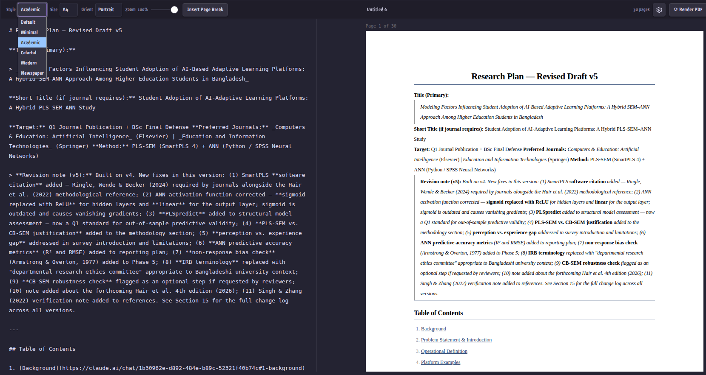
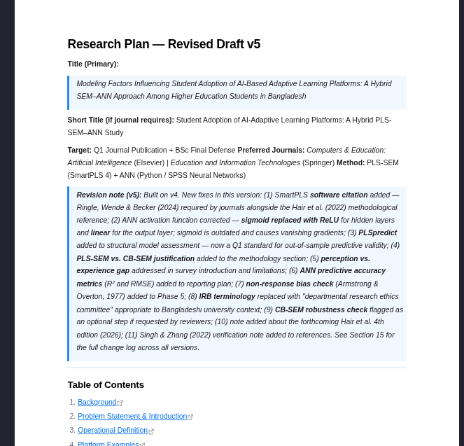
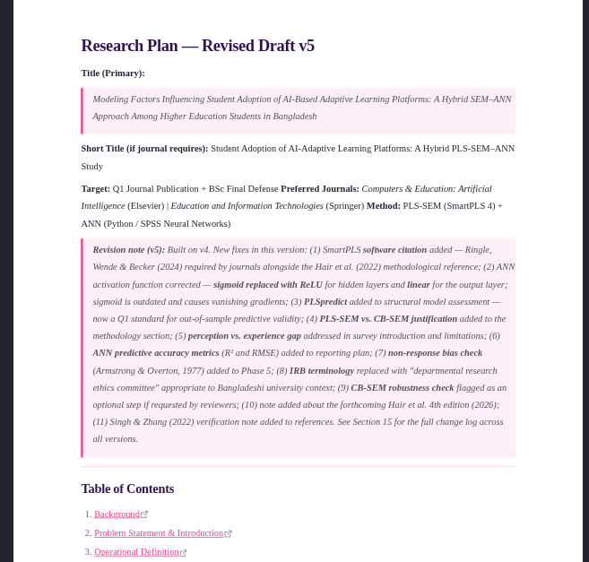
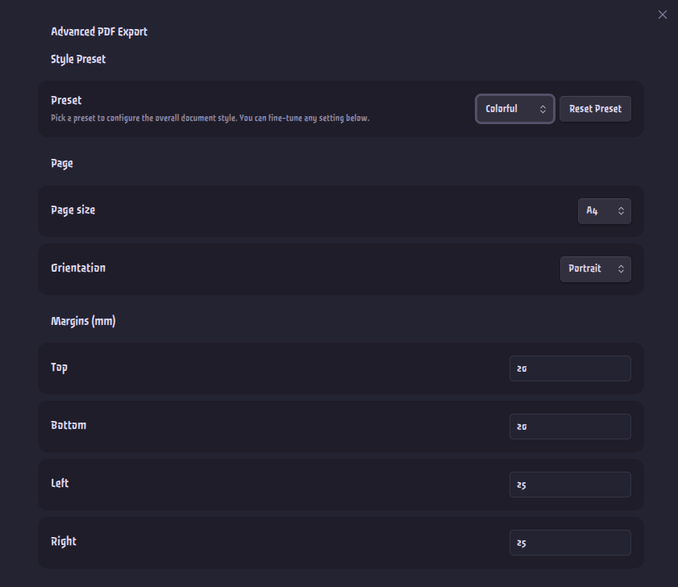
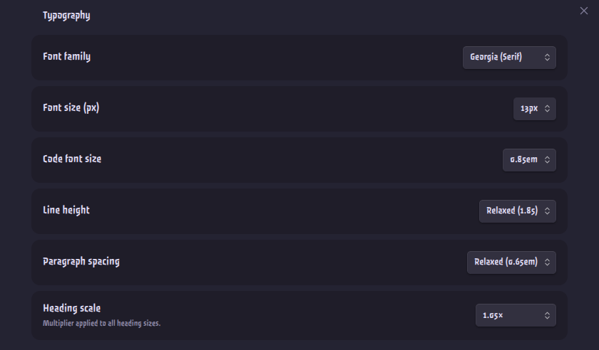
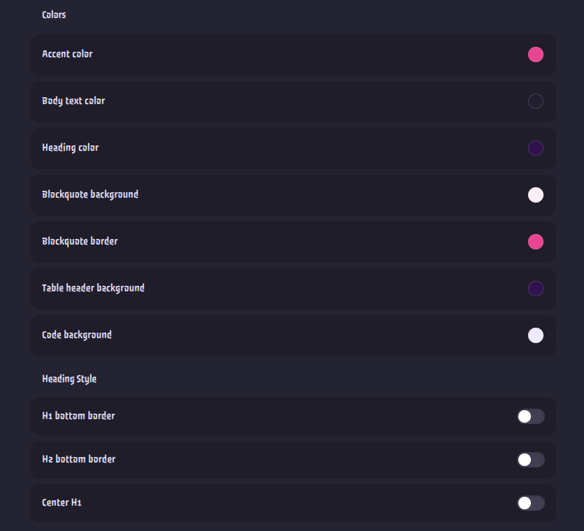
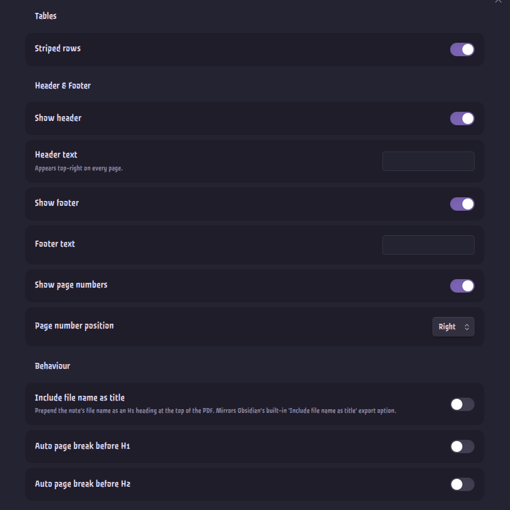

# Advanced PDF Export — Obsidian Plugin

Export Obsidian notes as pixel-perfect PDFs with seven style presets, manual page breaks, full layout control, and a live preview — all from a full-screen modal panel.

> **Desktop only** — requires the Obsidian desktop app (uses Electron's print pipeline).

## Table of Contents

- [Features](#features)
- [Screenshots](#screenshots)
- [Installation](#installation)
- [Usage](#usage)
- [Settings Reference](#settings-reference)
- [License](#license)

## Features

- **Live preview** — markdown editor on the left, paginated page preview on the right; render with **⟳ Render PDF** or `Ctrl+Enter`
- **Auto-loads active note** — opening from a note's right-click menu or command palette pre-fills the editor (edits are local, non-destructive)
- **Seven style presets** — Default, Minimal, Academic, Colorful, Modern, Newspaper, Dark
- **Page breaks** — `///` on its own line for a manual break; optionally auto-insert before every H1 or H2
- **Page size & orientation** — A4, A3, A5, Letter, Legal × Portrait / Landscape
- **Full layout control** — margins, font family/size/line height, paragraph spacing, heading scale, code font size, colors, heading borders, striped tables
- **Header & footer** — custom text, page numbers (X / Y), alignment, and first-page control

## Screenshots

### Panel Overview

### Page Breaks
Type `///` on its own line, or click **Insert Page Break** in the toolbar.

### Style Presets

### Settings Panel

## Installation

### Community Plugins (Recommended)
Search for **Advanced PDF Export** in **Settings → Community Plugins → Browse**, then install and enable it.

### Manual (GitHub Releases)
1. Go to the [Releases](https://github.com/ShrekBytes/advanced-pdf-export/releases) page.
2. Download `main.js`, `manifest.json`, and `styles.css` from the latest release.
3. Place them in your vault at `.obsidian/plugins/advanced-pdf-export/`.
4. Reload Obsidian and enable the plugin under **Settings → Community Plugins**.

## Usage

**Open the panel** — right-click any `.md` file in the file explorer, or use `Ctrl/Cmd+P` → *Advanced PDF Export: Open Panel*. The panel opens as a full-screen modal and auto-loads the target note.

**Edit markdown** — type or paste markdown in the left editor. Changes are not synced back to your vault.

**Insert a page break** — type `///` on its own line, or click **Insert Page Break** in the topbar. Use `---` for a horizontal rule.

**Render the preview** — click **⟳ Render PDF** or press `Ctrl+Enter` / `Cmd+Enter`.

**Change style or page settings** — use the **Style**, **Size**, and **Orient** dropdowns in the topbar. Changes re-render automatically.

**Export** — click **⬇ Export PDF** to open a native save dialog and write the PDF to disk.

**Open settings** — click the ⚙ icon in the topbar, or go to **Settings → Advanced PDF Export**.

## Settings Reference

All settings take effect after closing the settings panel.

### Style Preset
| Setting | Description |
|---|---|
| Preset | Style theme: Default, Minimal, Academic, Colorful, Modern, Newspaper, Dark |
| Reset Preset | Restores all typographic and color values for the current preset to defaults |

### Page
| Setting | Description |
|---|---|
| Page size | A4, A3, A5, Letter, Legal |
| Orientation | Portrait or Landscape |
| Margins (Top / Bottom / Left / Right) | In mm |

### Typography
| Setting | Options |
|---|---|
| Font family | Georgia, Times New Roman, Palatino, Arial, Helvetica, Trebuchet, Courier New, Custom |
| Custom font name | Any CSS font-family value (e.g. `Inter, sans-serif`); font must be installed on your system |
| Font size | 10 – 16 px |
| Code font size | 0.75em – 1.00em |
| Line height | Tight (1.4) → Double (2.0) |
| Paragraph spacing | None → Wide (1em) |
| Heading scale | 0.8× → 1.2× multiplier applied to all heading sizes |

### Colors
Accent · Body text · Headings · Page background · Blockquote background · Blockquote border · Table header background · Code background

### Heading Style
| Setting | Description |
|---|---|
| H1 bottom border | Draws a line under every H1 |
| H2 bottom border | Draws a subtle line under every H2 |
| Center H1 | Centers all H1 headings |

### Tables
| Setting | Description |
|---|---|
| Striped rows | Alternating row background on even rows |

### Header & Footer
| Setting | Description |
|---|---|
| Show header | Toggle the header on or off |
| Header text | Custom text shown on every page |
| Header alignment | Left, Center, or Right |
| Show footer | Toggle the footer on or off |
| Footer border | Show a separator line above the footer |
| Footer text | Custom text shown in the footer |
| Show page numbers | Toggle *Page X / Y* display |
| Page number position | Left, Center, or Right |
| Page number start | Number assigned to the first visible page (default 1) |
| Header/footer on first page | When off, page 1 has no header, footer, or page number |

### Behaviour
| Setting | Description |
|---|---|
| Hide frontmatter | Strip the YAML frontmatter block (`--- … ---`) from preview and PDF |
| Include file name as title | Prepends the note's filename as an H1 at the top of the PDF |
| Auto page break before H1 | Inserts a page break before every `#` heading |
| Auto page break before H2 | Inserts a page break before every `##` heading |

## License

Open source under [GPL-3.0 License](LICENSE)
